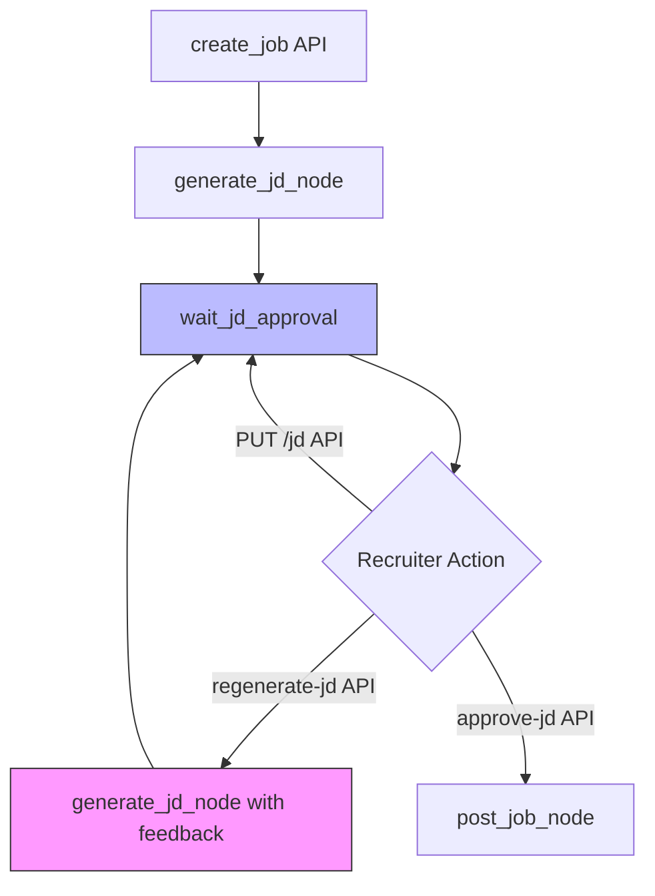

# Job Description Optimization Skill

## Purpose
This skill helps you optimize AI-generated job descriptions (JDs) for the AARLP platform. It ensures JDs are SEO-optimized, ATS-friendly, and conversion-focused while maintaining the platform's AI-generated quality standards.

## When to Use
- After AI generates a new JD
- When a recruiter requests JD improvements
- Before posting jobs to external boards (Indeed, LinkedIn)
- When optimizing for specific industries or roles

## Optimization Checklist

### 1. SEO Optimization
- [ ] Include primary keyword in title (role + location)
- [ ] Use semantic keywords naturally throughout
- [ ] Add location information (city, state, remote options)
- [ ] Include salary range if available (increases visibility by 30%)
- [ ] Use structured data markup for Google for Jobs

**Keywords to Include:**
- Job title variations
- Required technologies/tools
- Industry-specific terms
- Location-based keywords
- Remote/hybrid keywords

### 2. ATS Compliance
- [ ] Avoid tables, images, or complex formatting
- [ ] Use standard section headers (Responsibilities, Qualifications, Benefits)
- [ ] Include exact skill matches from industry standards
- [ ] Use common job title formats
- [ ] Avoid abbreviations without full terms first

### 3. Structure & Readability
```markdown
Standard JD Structure:
1. Hook (1-2 sentences) - Company mission/value prop
2. Role Overview (2-3 sentences) - What they'll do
3. Responsibilities (5-7 bullet points)
4. Qualifications
   - Required (3-5 must-haves)
   - Preferred (2-4 nice-to-haves)
5. Benefits & Perks (4-6 compelling points)
6. About Company (2-3 sentences)
7. CTA (Apply now with clear next steps)
```

### 4. Conversion Optimization
- [ ] Start with a compelling hook (not just "We are hiring...")
- [ ] Highlight unique selling points (culture, growth, impact)
- [ ] Use inclusive language (avoid gendered terms, "rock star", "ninja")
- [ ] Include remote/flexible work options prominently
- [ ] Add salary transparency (increases applications by 30%)
- [ ] Clear call-to-action with application timeline

### 5. Industry-Specific Enhancements

#### Tech Roles
- Include tech stack with versions
- Mention engineering practices (CI/CD, code review, testing)
- Highlight learning budget, conference attendance
- Specify remote work policy clearly

#### Non-Tech Roles
- Focus on impact and growth opportunities
- Include team structure and reporting lines
- Mention training and development programs
- Highlight company culture and values

## Implementation in AARLP

### Using the API
```python
# Regenerate JD with specific feedback
POST /jobs/{job_id}/regenerate-jd
{
    "feedback": "Add more emphasis on remote work options and salary range. Include specific technologies like FastAPI, LangGraph, Pinecone."
}
```

### Manual Editing
```python
# Update specific JD sections
PUT /jobs/{job_id}/jd
{
    "title": "Senior Backend Engineer - FastAPI & AI (Remote)",
    "responsibilities": [...],
    "benefits": [
        "Competitive salary: $120k-$160k",
        "100% remote work - US timezone",
        ...
    ]
}
```

## Validation Steps

1. **Run SEO Analysis**
   - Check keyword density (1-2% for primary keyword)
   - Verify meta description length (150-160 chars)
   - Ensure title is under 60 characters

2. **Readability Check**
   - Flesch Reading Ease: 60-70 (8th-9th grade level)
   - Sentence length: 15-20 words average
   - Paragraph length: 2-4 sentences max

3. **Bias Detection**
   - Run through gender decoder tools
   - Avoid age-related terms ("digital native", "recent grad")
   - Use neutral pronouns or "you/your"

## Common Issues & Fixes

| Issue | Fix |
|-------|-----|
| Too generic | Add company-specific details, tech stack, projects |
| Too formal | Use conversational tone, "you'll" instead of "candidate will" |
| Unclear expectations | Quantify responsibilities ("manage 3-5 direct reports") |
| Missing benefits | Add at least 4 compelling benefits |
| Poor mobile formatting | Break long paragraphs, use bullet points |

## AARLP Integration: Workflow & Code Paths

### How JD Optimization Fits in the LangGraph Workflow

```python
# app/workflow/nodes.py - generate_jd_node
async def generate_jd_node(state: GraphState) -> GraphState:
    """
    Node that generates JD and automatically applies optimization rules.
    """
    from app.ai.jd_generator import generate_job_description
    from app.jobs.schemas import JobInput
    
    # Extract job input from state
    job_input = JobInput(**state.jd.input_data)
    
    # Generate initial JD
    generated_jd = await generate_job_description(job_input)
    
    # OPTIMIZATION CHECKPOINT: Apply SEO and ATS rules
    optimized_jd = apply_optimization_rules(generated_jd, job_input)
    
    return state.model_copy(
        update={
            "jd": state.jd.model_copy(
                update={
                    "content": optimized_jd.description,
                    "title": optimized_jd.job_title,
                    "status": Status.COMPLETED
                }
            )
        }
    )
```

### Feedback Formats That Work with AARLP's AI

The `regenerate_job_description()` function in `app/ai/jd_generator.py` expects specific feedback patterns:

**✅ Effective Feedback Examples:**

```python
# 1. Specific additions
feedback = """
Add emphasis on remote work flexibility and include salary range $120k-$160k.
Mention that we use FastAPI, LangGraph, and Pinecone in the tech stack.
"""

# 2. Tone adjustments
feedback = """
Make the tone more conversational and less corporate.
Replace 'candidate will be responsible for' with 'you'll get to work on'.
"""

# 3. SEO-focused
feedback = """
Include keywords: 'AI engineer', 'machine learning', 'python developer'.
Add location 'San Francisco Bay Area' for better local search visibility.
"""

# 4. Structural changes
feedback = """
Move benefits section before requirements.
Add a 'What You'll Build' section highlighting real projects.
Break requirements into 'Must Have' and 'Nice to Have' subsections.
"""
```

**❌ Ineffective Feedback (Too Vague):**

```python
# Won't produce good results
feedback = "Make it better"
feedback = "Sounds too boring"
feedback = "Add more details"
```

### API Integration Points

```python
# 1. Regenerate with optimization feedback (POST /jobs/{id}/regenerate-jd)
async def regenerate_with_seo_focus(job_id: str, auth_headers: dict):
    """
    Trigger regeneration with SEO optimization focus.
    This updates the workflow state and resumes from checkpoint.
    """
    response = await fetch(
        f"http://localhost:8000/jobs/{job_id}/regenerate-jd",
        method="POST",
        headers=auth_headers,
        json={
            "feedback": """
            Optimize for Google for Jobs:
            - Add explicit salary range in title
            - Include 'Remote' or location in title
            - Use job title keywords that match common searches
            - Add structured benefits section
            """
        }
    )
    
    # This triggers the workflow to:
    # 1. Load checkpoint from wait_jd_approval state
    # 2. Call generate_jd_node with feedback
    # 3. Return to wait_jd_approval for re-review
    
    return response.json()

# 2. Manual edit (PUT /jobs/{id}/jd)
async def manual_optimization_edit(job_id: str, auth_headers: dict):
    """
    Directly update JD fields without AI regeneration.
    Use when recruiter knows exact changes needed.
    """
    response = await fetch(
        f"http://localhost:8000/jobs/{job_id}/jd",
        method="PUT",
        headers=auth_headers,
        json={
            "summary": "Join our mission to revolutionize recruitment...",
            "requirements": [
                "5+ years Python development (FastAPI, Django, or Flask)",
                "Experience with AI/ML frameworks (LangChain, OpenAI SDK)",
                "PostgreSQL and vector databases (Pinecone preferred)"
            ],
            "salary_range": "$120,000 - $160,000 + equity"
        }
    )
    
    # This updates the DB directly, bypassing workflow
    # No state change, JD remains in wait_jd_approval
    
    return response.json()

# 3. Check if optimization is needed (GET /jobs/{id}/jd)
async def analyze_jd_quality(job_id: str, auth_headers: dict):
    """
    Fetch JD and run optimization checks programmatically.
    """
    response = await fetch(
        f"http://localhost:8000/jobs/{job_id}/jd",
        headers=auth_headers
    )
    
    jd = response.json()
    
    # Run checks
    issues = []
    
    if not jd.get("salary_range") or jd["salary_range"] == "Competitive":
        issues.append("Missing explicit salary range (reduces visibility by 30%)")
    
    if len(jd.get("description", "")) < 200:
        issues.append("Description too short for SEO (minimum 200 chars)")
    
    if "remote" not in jd.get("title", "").lower() and "location" not in jd.get("title", "").lower():
        issues.append("Title missing location/remote keyword")
    
    return {
        "needs_optimization": len(issues) > 0,
        "issues": issues,
        "suggestion": "Run regenerate with: " + "; ".join(f"Fix: {i}" for i in issues)
    }
```

### Workflow State Transitions



**Key Points:**
- `regenerate-jd` triggers a **full workflow state update** and resumes graph execution
- `PUT /jd` is a **direct DB update** without workflow interaction
- Use regenerate for AI-driven changes, PUT for manual tweaks

### Optimization Rules Engine (Code Reference)

```python
# Add to app/ai/jd_generator.py or create app/ai/jd_optimizer.py

from app.jobs.schemas import GeneratedJD, JobInput

def apply_optimization_rules(jd: GeneratedJD, job_input: JobInput) -> GeneratedJD:
    """
    Apply automatic optimization rules to generated JD.
    
    Rules:
    1. Ensure title has location/remote
    2. Add salary if missing
    3. Validate readability
    4. Check ATS keywords
    """
    optimized = jd.model_copy()
    
    # Rule 1: Location in title
    if job_input.location and job_input.location.lower() not in jd.job_title.lower():
        optimized.job_title = f"{jd.job_title} ({job_input.location})"
    
    # Rule 2: Salary transparency
    if not jd.salary_range or jd.salary_range == "Competitive":
        if job_input.salary_range:
            optimized.salary_range = job_input.salary_range
        else:
            # Suggest to recruiter
            logger.warning("No salary range provided - reduces application rate by 30%")
    
    # Rule 3: Readability (sentence length)
    if optimized.description:
        sentences = optimized.description.split('. ')
        avg_length = sum(len(s.split()) for s in sentences) / len(sentences)
        if avg_length > 25:
            logger.info("High sentence complexity detected - consider simplification")
    
    # Rule 4: Benefits minimum count
    if len(optimized.benefits) < 4:
        logger.warning("Less than 4 benefits listed - consider adding more")
    
    return optimized
```

### Real Optimization Workflow Example

```python
# Complete example: Optimize a generated JD

# 1. Job created, JD generated (automatic)
POST /jobs/create
{
    "role_title": "Senior Backend Engineer",
    "company_name": "TechCorp",
    "experience_years": 5,
    "key_requirements": ["Python", "FastAPI", "PostgreSQL"],
    "salary_range": "$130k-$170k"
}
# Response: job_id = "abc-123"
# Graph runs: generate_jd_node -> wait_jd_approval

# 2. Recruiter reviews generated JD
GET /jobs/abc-123/jd
{
    "job_title": "Senior Backend Engineer",
    "description": "Join our team...",
    // Missing: remote info, specific tech stack details
}

# 3. Recruiter provides optimization feedback
POST /jobs/abc-123/regenerate-jd
{
    "feedback": "Add 'Remote - US' to title. Emphasize FastAPI and LangGraph experience. Include equity compensation."
}
# Graph resumes: generate_jd_node (with feedback) -> wait_jd_approval

# 4. Recruiter reviews optimized version
GET /jobs/abc-123/jd
{
    "job_title": "Senior Backend Engineer (Remote - US)",
    "description": "...FastAPI and LangGraph...",
    "salary_range": "$130k-$170k + equity"
}

# 5. Approve and post
POST /jobs/abc-123/approve-jd
# Graph continues: post_job_node -> ...
```

## Best Practices

1. **Always preserve AI-generated structure** - Only enhance, don't rewrite completely
2. **Use recruiter feedback** - The regeneration API is your friend
3. **Test with Pinecone embeddings** - Ensure semantic search quality isn't degraded
4. **A/B test different versions** - Track application rates
5. **Keep industry standards** - Reference OpenAI research in JD generation logic

## Tools & Resources

- **Gender Decoder**: Check for gendered language
- **Hemingway Editor**: Readability analysis
- **Google for Jobs Testing Tool**: Validate structured data
- **AARLP Semantic Analyzer**: `app/ai/embeddings.py` - Test JD embeddings

## Example Optimization

**Before (Generic):**
```
We are looking for a Software Engineer to join our team.
```

**After (Optimized):**
```
Join our mission to revolutionize recruitment with AI. As a Senior Backend Engineer, you'll architect scalable FastAPI services that power real-time candidate matching for Fortune 500 companies - all while working 100% remotely.
```

**Key Improvements:**
✅ Specific role level
✅ Tech stack mentioned
✅ Impact/mission highlighted
✅ Remote work explicitly stated
✅ Social proof (Fortune 500)
✅ Active voice, direct address

---

## Related Skills

- **[workflow_management](../workflow_management/SKILL.md)** - Understanding how `regenerate-jd` API calls trigger LangGraph state transitions and checkpoint resumption
- **[semantic_search](../semantic_search/SKILL.md)** - Optimizing JD text affects embedding quality and candidate matching accuracy
- **[api_testing](../api_testing/SKILL.md)** - Testing JD regeneration flows and validation logic

---
