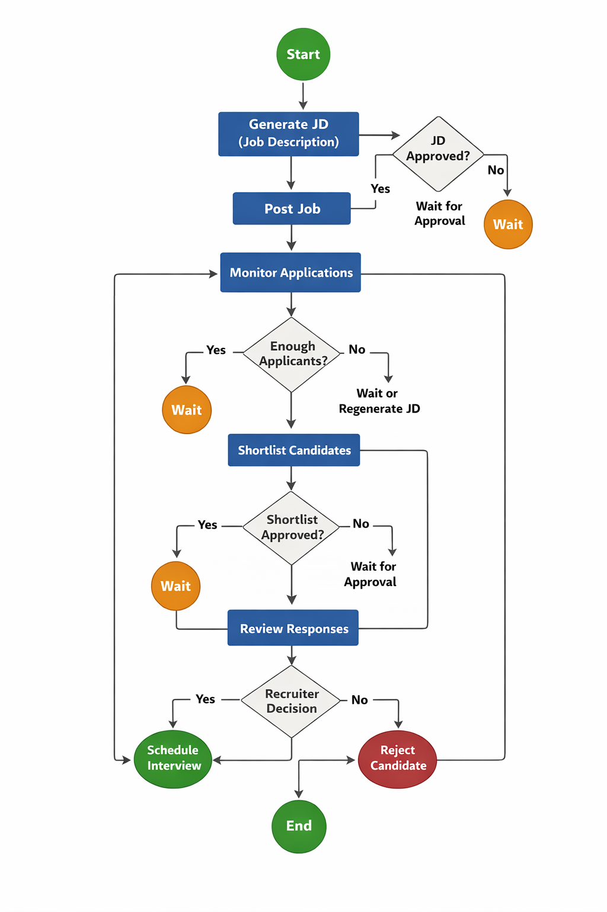

# AARLP - AI-Agentic Recruitment Lifecycle Platform

Welcome to **AARLP**, an advanced **AI-Agentic Recruitment Lifecycle Platform** designed to automate the end-to-end hiring pipeline. From generating SEO-optimized Job Descriptions to conducting AI voice prescreening interviews, AARLP leverages state-of-the-art AI agents (LangGraph, OpenAI) to streamline recruitment.

---

## 🚀 Key Features

### 🧠 Core Intelligence (AI Agents)
- **AI-Powered JD Ecosystem**:
    - **Generation**: Uses OpenAI to research industry standards and craft compelling JDs.
    - **Regeneration & Feedback**: Recruiters can provide feedback to the AI to refine JDs or manually edit specific sections.
- **Agentic Workflow**:
    - Powered by **LangGraph** for robust, stateful orchestration.
    - Implementation of **Checkpointers** for persistent workflow state management (pause/resume capabilities).
- **Semantic Matching**: Uses **Pinecone** and OpenAI Embeddings to semantically post-screen and rank candidates against job requirements, going beyond keyword matching.
- **Voice AI Prescreening** (Foundation): Architecture ready for automated phone screening using Twilio/ElevenLabs to assess candidate communication.

### 🎨 Modern Frontend Experience
- **Next.js 14 App Router**: Server-side rendering for optimal performance.
- **Themeable UI**: Fully supported **Light & Dark Mode** with high-contrast, accessibility-focused colors.
- **Refined Aesthetics**: Premium "Glassmorphism" UI components (Sidebar, Cards, Inputs).
- **Interactive Dashboard**:
    - **Job Wizard**: Step-by-step AI job creation.
    - **JD Editor**: Inline, modal-based editing and regeneration.
    - **Candidates View**: Visual list of applicants with AI match scores.
    - **Real-time Updates**: Live polling for job status changes.

### 🛡️ Robust Backend
- **FastAPI**: High-performance, async Python web framework.
- **Clean Architecture**: Modular, domain-driven design with type-safe Pydantic models.
- **Secure Authentication**: JWT-based flow with **Email OTP Verification** (FastAPI-Mail).
- **Database**: PostgreSQL (Relational Data) + **Pinecone** (Vector Embeddings).

---

## 🛠️ Technical Architecture

### Tech Stack

| Component | Technology | Description |
|-----------|------------|-------------|
| **Backend API** | **FastAPI** | High-performance, async Python web framework. |
| **Frontend** | **Next.js 14** | React framework with TypeScript, Tailwind CSS, Next-Themes. |
| **Orchestration** | **LangGraph** | Stateful graph-based workflow for AI agents (Nodes/Edges). |
| **LLM** | **OpenAI GPT-4** | Intelligence engine for agents, generation, and embeddings. |
| **Database** | **PostgreSQL** | Primary relational database with async support. |
| **Vector DB** | **Pinecone** | Serverless vector database for semantic search. |
| **Voice AI** | **Twilio / ElevenLabs** | Telephony and Text-to-Speech infrastructure (Modules ready). |
| **Email** | **FastAPI-Mail** | SMTP client for transactional emails (OTP). |
| **Validation** | **Pydantic v2** | Type-safe data validation with runtime checks. |

### Software Architecture

The project follows a **Clean Architecture** inspired modular structure with emphasis on type safety and maintainability:

```bash
aarlp/
├── app/                      # FastAPI Application
│   ├── ai/                   # AI Logic (Embeddings, Voice, JD Generation)
│   │   ├── client.py         # OpenAI client wrapper
│   │   ├── embeddings.py     # Pinecone vector operations
│   │   ├── jd_generator.py   # Job description AI generation
│   │   ├── voice_agent.py    # Voice prescreening agent
│   │   └── voice_scoring.py  # Response scoring logic
│   ├── auth/                 # Authentication & User Management
│   │   ├── models.py         # User SQLAlchemy models
│   │   ├── router.py         # Auth API endpoints
│   │   ├── schemas.py        # Pydantic request/response schemas
│   │   └── service.py        # Authentication business logic
│   ├── candidates/           # Applicant Processing & Ranking
│   │   ├── schemas.py        # Applicant, CandidateResponse models
│   │   └── services.py       # Candidate ranking logic
│   ├── core/                 # Global Infrastructure
│   │   ├── config.py         # Settings with Pydantic BaseSettings
│   │   ├── database.py       # Async SQLAlchemy setup
│   │   ├── exceptions.py     # Custom exception hierarchy
│   │   ├── locking.py        # Distributed locking (Redis)
│   │   └── logging.py        # Structured logging
│   ├── interviews/           # Interview Scheduling
│   │   ├── schemas.py        # PrescreeningQuestion, InterviewSlot
│   │   └── scheduler.py      # Interview scheduling logic
│   ├── jobs/                 # Job Management (Core Domain)
│   │   ├── dependencies.py   # FastAPI dependency injection
│   │   ├── models.py         # Job SQLAlchemy models
│   │   ├── repository.py     # Database operations
│   │   ├── router.py         # Job API endpoints
│   │   ├── schemas.py        # JobInput, GeneratedJD, etc.
│   │   └── services.py       # Job business logic orchestration
│   ├── workflow/             # LangGraph Workflow Engine
│   │   ├── builder.py        # Graph construction & compilation
│   │   ├── checkpoints.py    # State persistence helpers
│   │   ├── constants.py      # NodeName enum & workflow constants
│   │   ├── edges.py          # Conditional routing functions
│   │   ├── engine.py         # High-level workflow abstraction
│   │   ├── exceptions.py     # Workflow-specific exceptions
│   │   ├── helpers.py        # Reusable node utilities
│   │   ├── nodes.py          # Workflow node functions
│   │   └── state.py          # Pydantic-based GraphState
│   └── main.py               # Application entry point
├── frontend/                 # Next.js Application
│   ├── app/                  # App Router Pages
│   │   ├── (auth)/           # Auth Routes (Login, Register, OTP)
│   │   └── (dashboard)/      # Protected App Routes (Jobs, Candidates)
│   ├── components/           # Reusable UI Library (Theme-aware)
│   └── features/             # Feature-specific components
├── tests/                    # Pytest Suite
│   ├── workflow/             # Workflow unit tests
│   │   ├── test_nodes.py     # Node function tests
│   │   ├── test_edges.py     # Edge routing tests
│   │   └── test_state_validation.py  # State validation tests
│   └── conftest.py           # Shared fixtures
└── alembic/                  # Database migrations
```

---

## 🔄 Workflow Architecture

### State Machine Overview

The recruitment workflow is powered by **LangGraph** with Pydantic-based state management:



**Key Flow Points:**
- **Human-in-the-Loop**: Wait states for JD approval, shortlist approval, and recruiter decisions
- **Conditional Routing**: Dynamic branching based on applicant count and approval status
- **State Persistence**: Checkpointing enables pause/resume at any stage

### Workflow State (Pydantic Models)

The workflow uses **type-safe Pydantic models** for state management:

```python
class GraphState(BaseModel):
    """Pydantic-based workflow state with full type safety."""
    job_id: str
    thread_id: Optional[str] = None
    current_node: str
    error_message: Optional[str] = None
    
    # Nested state groups
    jd: JobDescriptionState           # JD generation & approval
    posting: JobPostingState          # Job posting status
    applicants: ApplicantState        # Applicants & shortlisting
    prescreening: PrescreeningState   # Voice prescreening
    interviews: InterviewState        # Interview scheduling
    
    created_at: datetime
    updated_at: datetime
```

**Benefits:**
- ✅ Full IDE autocomplete with attribute access (`state.jd.approval_status`)
- ✅ Runtime validation on every state change
- ✅ Type-safe nested state objects
- ✅ No manual dict-to-object conversions

### Workflow Nodes

| Node | Description |
|------|-------------|
| `generate_jd_node` | AI-powered job description generation |
| `post_job_node` | Browser automation for job posting |
| `monitor_applications_node` | Track incoming applications |
| `shortlist_candidates_node` | Semantic similarity ranking |
| `voice_prescreening_node` | AI voice interview calls |
| `review_responses_node` | Recruiter review interface |
| `schedule_interview_node` | Calendar integration |
| `reject_candidate_node` | Rejection handling |

### Custom Exceptions

The workflow uses a **hierarchical exception system** for precise error handling:

```
GraphError (Base)
├── GraphExecutionError
├── InvalidStateTransitionError
├── JDGenerationError
├── JobPostingError
├── ShortlistingError
├── PrescreeningError
├── SchedulingError
└── FeatureNotImplementedError
```

---

## 🏃‍♂️ Getting Started

### Prerequisites
- Python 3.11+
- Node.js 18+
- PostgreSQL 15+
- Redis (for distributed locking)
- Pinecone Account (API Key)

### 1. Backend Setup

1. **Clone & Navigate**:
    ```bash
    git clone https://github.com/immuhammadfurqan/aarlp.git
    cd aarlp
    ```

2. **Virtual Environment**:
    ```bash
    python -m venv venv
    
    # Windows
    venv\Scripts\activate
    
    # Mac/Linux
    source venv/bin/activate
    ```

3. **Install Dependencies**:
    ```bash
    pip install -r requirements.txt
    ```

4. **Database Setup**:
    ```bash
    # Create database
    createdb aarlp
    
    # Run migrations
    alembic upgrade head
    ```

5. **Run Server**:
    ```bash
    uvicorn app.main:app --reload
    ```
    - Backend: `http://localhost:8000`
    - Swagger Docs: `http://localhost:8000/docs`

### 2. Frontend Setup

1. **Navigate to Frontend**:
    ```bash
    cd frontend
    ```

2. **Install Dependencies**:
    ```bash
    npm install
    ```

3. **Run Development Server**:
    ```bash
    npm run dev
    ```
    Frontend runs at `http://localhost:3000`.

---

## ⚙️ Configuration

Create a `.env` file in the root directory (see `.env.example`):

### Essential
| Variable | Description |
|----------|-------------|
| `DATABASE_URL` | PostgreSQL Connection String |
| `OPENAI_API_KEY` | OpenAI API Key |
| `SECRET_KEY` | JWT Signing Key |
| `REDIS_URL` | Redis connection for distributed locking |

### Vector Database (Pinecone)
| Variable | Description |
|----------|-------------|
| `PINECONE_API_KEY` | Pinecone API Key |
| `PINECONE_INDEX` | Index Name (e.g., "aarlp-embeddings") |

### Email (SMTP)
| Variable | Description |
|----------|-------------|
| `MAIL_USERNAME` | SMTP User |
| `MAIL_PASSWORD` | App Password |
| `MAIL_SERVER` | SMTP Server |
| `MAIL_PORT` | SMTP Port |

### Feature Flags
| Variable | Description | Default |
|----------|-------------|---------|
| `JOB_POSTING_ENABLED` | Enable job posting automation | `false` |
| `APPLICATION_MONITORING_ENABLED` | Enable application monitoring | `false` |

### Voice AI (Optional)
| Variable | Description |
|----------|-------------|
| `TWILIO_ACCOUNT_SID` | Twilio Account ID |
| `TWILIO_AUTH_TOKEN` | Twilio Auth Token |
| `ELEVENLABS_API_KEY` | ElevenLabs Key (if using ElevenLabs) |

---

## 🔗 API Reference

Access the fully interactive Swagger documentation at: **`http://localhost:8000/docs`**

### Key Endpoints

#### Authentication
- `POST /auth/register`: Create a new account (triggers OTP email).
- `POST /auth/verify-otp`: Verify account activation.
- `POST /auth/login`: Authenticate and receive `access_token`.

#### Jobs
- `POST /jobs/create`: Initialize a new recruitment workflow.
- `GET /jobs/status/{id}`: Get the real-time status of the AI agent.
- `GET /jobs/{id}/jd`: Retrieve the AI-generated Job Description.
- `PUT /jobs/{id}/jd`: Manually update the Job Description.
- `POST /jobs/{id}/regenerate-jd`: Regenerate JD with AI feedback.
- `POST /jobs/{id}/approve-jd`: Approve the JD and move to "Post Job" phase.
- `POST /jobs/{id}/approve-shortlist`: Approve shortlisted candidates.

#### Candidates
- `GET /jobs/{id}/candidates`: List candidates with semantic match scores.
- `POST /jobs/{id}/mock/add-applicants`: Inject mock candidates for testing.

---

## 🧪 Testing

Run the test suite:

```bash
# All tests
pytest tests/ -v

# Workflow tests only
pytest tests/workflow/ -v

# With coverage
pytest tests/ -v --cov=app --cov-report=html
```

### Test Coverage

| Module | Tests |
|--------|-------|
| `workflow/nodes` | Node functions, helper utilities |
| `workflow/edges` | Conditional routing logic |
| `workflow/state` | State validation functions |

---

## 📊 Code Quality

The codebase follows **Clean Code principles** with a score of **9.5/10**:

### Architecture Highlights

| Aspect | Implementation |
|--------|----------------|
| **Type Safety** | Pydantic v2 models with runtime validation |
| **State Management** | Immutable-friendly Pydantic BaseModel |
| **Error Handling** | Hierarchical custom exceptions |
| **DRY Principle** | Centralized helpers in `workflow/helpers.py` |
| **Constants** | Enums and constants in `workflow/constants.py` |
| **Separation** | Clear node/edge/state/engine boundaries |

### Clean Code Practices

- ✅ **Single Responsibility**: Each module has one job
- ✅ **Meaningful Names**: Self-documenting code
- ✅ **Small Functions**: Focused, testable units
- ✅ **No Magic**: Constants and enums everywhere
- ✅ **Type Hints**: Full type annotations
- ✅ **Docstrings**: Comprehensive documentation

---

## 🗺️ Roadmap & Status

- [x] **Phase 1: Setup & Auth**
    - [x] User Management (Register, Login, Users Module)
    - [x] Secure OTP Verification via Email
- [x] **Phase 2: Core Job Workflow**
    - [x] AI JD Generation
    - [x] JD Editing & Regeneration (Human-in-the-Loop)
    - [x] LangGraph Orchestration with Checkpointing
    - [x] Pydantic-based State Management
- [x] **Phase 3: Frontend Experience**
    - [x] Comprehensive Dashboard
    - [x] Light/Dark Mode Implementation
    - [x] Real-time Status Polling
- [x] **Phase 4: Candidate Management**
    - [x] Mock Applicant Injection
    - [x] Candidates List View
    - [x] Semantic Similarity Scoring
    - [x] Shortlist Approval Flow
- [x] **Phase 5: Code Quality**
    - [x] Clean Code Refactoring (9.5/10 score)
    - [x] Pydantic State Migration
    - [x] Comprehensive Unit Tests
    - [x] Custom Exception Hierarchy
- [ ] **Phase 6: Voice AI Integration**
    - [ ] Twilio/ElevenLabs connection
    - [ ] Automated prescreening calls
- [ ] **Phase 7: Interview Scheduling**
    - [ ] Google Calendar Integration
    - [ ] Automated scheduling

---

## 📜 License

This project is licensed under the MIT License.

---

## 🤝 Contributing

1. Fork the repository
2. Create a feature branch (`git checkout -b feature/amazing-feature`)
3. Commit your changes (`git commit -m 'Add amazing feature'`)
4. Push to the branch (`git push origin feature/amazing-feature`)
5. Open a Pull Request

---

**Built with ❤️ using FastAPI, LangGraph, Next.js, and OpenAI**
